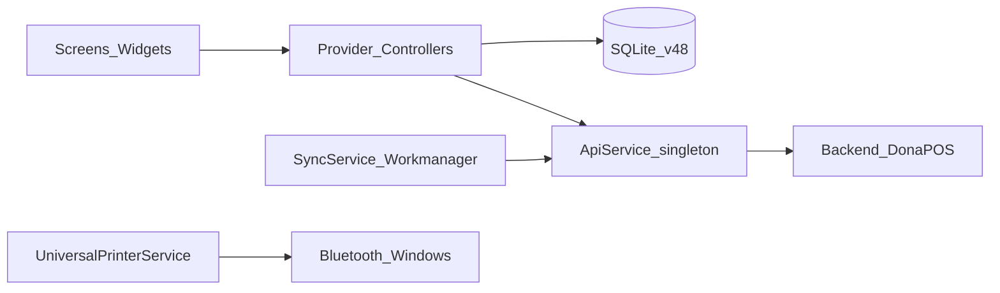

# Catatan Audit Teknis — DonaPOS Mobile

| Field | Nilai |
|-------|-------|
| Tanggal audit | 17 Mei 2026 |
| Versi aplikasi | 2.8.0+10225 (`pubspec.yaml`) |
| Versi tampilan config | 2.7.9 (`lib/config.dart`) — inkonsisten |
| Schema database | v48 (`lib/db_helper.dart`, file `donapos_v11.db`) |
| Dokumen terkait | [RENCANA_PERBAIKAN.md](RENCANA_PERBAIKAN.md) |
| Dokumen historis | [ACTION_ITEMS.md](ACTION_ITEMS.md), [REVIEW_REPORT.md](REVIEW_REPORT.md) (usang) |

---

## Ringkasan eksekutif

DonaPOS Mobile adalah aplikasi POS Flutter **offline-first** untuk F&B, terintegrasi dengan backend ERP DonaPOS (OAuth 2 + REST). Secara fungsional aplikasi siap operasional harian: transaksi lokal, shift, printer, absensi, dan sync batch ke cloud.

Risiko utama bukan pada UI, melainkan pada **reliabilitas sinkronisasi transaksi** (transaksi bisa di-mark `synced` padahal gagal di server) dan **penyimpanan kredensial** (token, password, client secret di SharedPreferences tanpa enkripsi). Kedua area ini berpotensi menyebabkan **omset tidak ter-upload** atau **akses ERP bocor** di perangkat yang di-root/backup.

---

## Skor per area

| Area | Skor | Catatan singkat |
|------|------|-----------------|
| Arsitektur & fitur | 8/10 | Offline-first solid; `persistTransaction` memakai SQL transaction |
| Keamanan | 5/10 | Credential plaintext; OTP di client; cleartext HTTP di Android |
| Reliabilitas sync | 6/10 | Lock parsial; marking synced lemah; race foreground vs background |
| Maintainability | 5/10 | Beberapa file 2.000+ baris; hampir tidak ada unit test bermakna |
| Build / analyzer | 7/10 | 2 error hanya di `integration_test` (package hilang) |

---

## Arsitektur & stack

### Alur data



### Technology stack

| Komponen | Teknologi |
|----------|-----------|
| Framework | Flutter (SDK >=3.0) |
| State | Provider (`ChangeNotifier`) |
| Database | sqflite (+ sqflite_common_ffi untuk desktop) |
| HTTP | package `http` |
| Background | workmanager |
| Auth | OAuth password grant + Bearer token |
| Printer | blue_thermal_printer, bluetooth_print_plus, print_bluetooth_thermal |

### File terbesar (god classes)

| File | ~Baris | Catatan |
|------|--------|---------|
| `lib/screens/pos_screen.dart` | 2.585 | Layar kasir utama |
| `lib/api_service.dart` | 2.376 | API + sync + auth dalam satu kelas |
| `lib/widgets/report_dialog.dart` | 2.121 | Laporan |
| `lib/db_helper.dart` | 2.104 | Schema + migrasi + CRUD |
| `lib/screens/config_screen.dart` | 1.271 | Setup / aktivasi |
| `lib/screens/admin_dashboard.dart` | 1.248 | Dashboard admin |
| `lib/screens/login_screen.dart` | 1.187 | Login & PIN |

### Entry point

- [`lib/main.dart`](lib/main.dart): `MultiProvider` (Language, PosCart, PosProvider), landscape + wakelock di mobile.
- Splash → Login → POS / Admin Dashboard.

---

## Temuan audit

Setiap temuan: **ID**, deskripsi, lokasi, dampak bisnis, status.

### Kritis — data & sinkronisasi

#### AUD-SYNC-01: Mark transaksi synced berdasarkan indeks array

| | |
|---|---|
| **Lokasi** | `lib/api_service.dart`, `syncTransactionsWithLogs`, ~baris 2193–2199 |
| **Deskripsi** | Setelah POST batch ke `/connector/api/sell`, sukses ditentukan dengan membandingkan `responseData[k]` dengan `batch[k]` berdasarkan indeks `k`, bukan `invoice_no` atau ID lokal. |
| **Dampak** | Jika server mengembalikan urutan/jumlah berbeda, transaksi A bisa di-mark `synced` sementara B gagal — **omset hilang di cloud** tanpa peringatan di tablet. |
| **Status** | Belum diperbaiki |

```dart
// Pola bermasalah: index-based matching
for (int k = 0; k < batch.length; k++) {
  if (k < responseData.length) {
    final resItem = responseData[k];
    if (resItem is Map && resItem.containsKey('id') && ...) {
      await DatabaseHelper.instance.markTransactionSynced(batch[k]['id']);
```

#### AUD-SYNC-02: Race condition sync ganda (foreground + Workmanager)

| | |
|---|---|
| **Lokasi** | `lib/sync_service.dart` (timer tanpa `await`); `callbackDispatcher` di isolate terpisah |
| **Deskripsi** | Foreground timer memanggil `syncTransactions()` tanpa menunggu selesai. Workmanager menjalankan sync di isolate lain. Flag `_isGlobalSyncing` di `ApiService` **tidak dibagikan** antar isolate. |
| **Dampak** | Duplikat penjualan di ERP, HTTP 429/500, atau state inkonsisten. |
| **Status** | Belum diperbaiki |

#### AUD-SYNC-03: Retry 401 terbatas per proses sync

| | |
|---|---|
| **Lokasi** | `lib/api_service.dart`, variabel `hasRetriedBatch` |
| **Deskripsi** | Re-auth pada 401 hanya sekali per alur batch; batch berikutnya bisa gagal tanpa retry token jika token expired di tengah proses. |
| **Dampak** | Sebagian transaksi tidak ter-upload meski koneksi pulih setelah login ulang otomatis gagal. |
| **Status** | Belum diperbaiki |

---

### Kritis — keamanan

#### AUD-SEC-01: Kredensial disimpan plaintext di SharedPreferences

| | |
|---|---|
| **Lokasi** | `lib/api_service.dart` — `token`, `last_login_password`, `client_secret`; `lib/screens/login_screen.dart` — `sync_admin_pass` |
| **Deskripsi** | OAuth token, password login terakhir, dan client secret disimpan tanpa enkripsi di SharedPreferences. |
| **Dampak** | Backup perangkat, root, atau malware dapat mengambil akses penuh ke ERP. |
| **Status** | Belum diperbaiki |

#### AUD-SEC-02: OTP vendor/refund dihitung di client

| | |
|---|---|
| **Lokasi** | `lib/utils_ui.dart`, fungsi `calculateExpected` |
| **Deskripsi** | Algoritma challenge-response (6 digit vendor, 8 digit refund) ada di APK; bukan validasi server. |
| **Dampak** | Decompile APK memungkinkan bypass refund/reset tanpa vendor. |
| **Status** | Sebagian diperbaiki (PIN `0690`/`2024` sudah dihapus); algoritma client tetap lemah |

#### AUD-SEC-03: Cleartext HTTP diizinkan (Android)

| | |
|---|---|
| **Lokasi** | `android/app/src/main/AndroidManifest.xml`, `android:usesCleartextTraffic="true"` |
| **Deskripsi** | Traffic HTTP tidak terenkripsi diizinkan untuk seluruh app. |
| **Dampak** | Token dan payload penjualan dapat di-sniff di jaringan tidak aman. |
| **Status** | Belum diperbaiki |

#### AUD-SEC-04: PIN user di SQLite tanpa hashing

| | |
|---|---|
| **Lokasi** | `lib/db_helper.dart` — kolom `users.pin`; login membandingkan string langsung |
| **Deskripsi** | PIN kasir disimpan dan dibandingkan sebagai plaintext di database lokal. |
| **Dampak** | Ekstraksi file DB (`donapos_v11.db`) membuka semua PIN staff. |
| **Status** | Belum diperbaiki |

---

### Tinggi — stabilitas & operasional

#### AUD-DB-01: Rantai migrasi panjang (v48) dengan error disembunyikan

| | |
|---|---|
| **Lokasi** | `lib/db_helper.dart`, `_onUpgrade` |
| **Deskripsi** | Puluhan langkah migrasi berurutan; banyak `ALTER TABLE` dibungkus `catch (_) {}` sehingga kegagalan tidak terlihat. Duplikasi migrasi kolom `attendances` di beberapa versi. |
| **Dampak** | Update app di tablet lama: crash saat buka DB atau skema tidak lengkap → gagal jualan. |
| **Status** | Belum diperbaiki (index sync sudah ditambahkan di v46+) |

#### AUD-DB-02: `isMigrationNeeded()` membuka DB tanpa `onUpgrade`

| | |
|---|---|
| **Lokasi** | `lib/db_helper.dart`, `isMigrationNeeded` / `getLocalVersion` |
| **Deskripsi** | Membuka database hanya untuk membaca versi, tanpa callback migrasi penuh. |
| **Dampak** | UI migrasi bisa menampilkan status yang tidak selaras dengan perilaku `openDatabase` sebenarnya. |
| **Status** | Belum diperbaiki |

#### AUD-BG-01: Workmanager tanpa inisialisasi Flutter binding

| | |
|---|---|
| **Lokasi** | `lib/sync_service.dart`, `callbackDispatcher` |
| **Deskripsi** | Tidak ada `WidgetsFlutterBinding.ensureInitialized()` sebelum akses plugin/DB di background. |
| **Dampak** | Sync background bisa gagal diam-diam. |
| **Status** | Belum diperbaiki |

#### AUD-DEMO-01: PIN default demo `12345`

| | |
|---|---|
| **Lokasi** | `lib/db_helper.dart`, seed user `tashia` / `aurel` |
| **Deskripsi** | Mode demo meng-seed admin dan kasir dengan PIN `12345`. |
| **Dampak** | Jika demo tidak dimatikan di perangkat produksi, login trivial. |
| **Status** | Belum diperbaiki |

---

### Sedang — kualitas kode

#### AUD-CODE-01: God files sulit diuji dan rentan regresi

| | |
|---|---|
| **Lokasi** | `pos_screen.dart`, `api_service.dart`, `report_dialog.dart` |
| **Dampak** | Perubahan kecil berisiko efek samping besar; onboarding developer lambat. |
| **Status** | Sebagian refactor POS sudah dimulai (`lib/screens/pos/components/`) |

#### AUD-CODE-02: TextEditingController tanpa dispose di dialog POS

| | |
|---|---|
| **Lokasi** | `lib/screens/pos_screen.dart` — controller dibuat inline di beberapa dialog |
| **Dampak** | Kebocoran memori pada sesi kasir 8–12 jam. |
| **Status** | Belum diperbaiki (scroll controller utama sudah di-dispose) |

#### AUD-CODE-03: Tidak ada global error handler

| | |
|---|---|
| **Lokasi** | `lib/main.dart` |
| **Deskripsi** | Tidak ada `FlutterError.onError` / `runZonedGuarded`. |
| **Dampak** | Crash production sulit dilacak secara terpusat. |
| **Status** | `LoggerService` ada tetapi tidak terpasang global |

#### AUD-CODE-04: Mapping pajak vs round-off di payload sync

| | |
|---|---|
| **Lokasi** | `lib/api_service.dart`, ~baris 2110–2138 |
| **Deskripsi** | Field lokal `tax` dipakai untuk logika internal; `round_off_amount` dikirim `0` ke ERP. |
| **Dampak** | Selisih angka antara tablet dan laporan ERP. |
| **Status** | Perlu verifikasi dengan kontrak API backend |

---

### Rendah — housekeeping

| ID | Temuan | Lokasi | Status |
|----|--------|--------|--------|
| AUD-HK-01 | Inkonsistensi versi (pubspec 2.8.0 vs config 2.7.9 vs README 2.5.0) | `pubspec.yaml`, `lib/config.dart`, `README.md` | Belum |
| AUD-HK-02 | File backup di repo | `lib/api_service.dart.backup` | Belum |
| AUD-HK-03 | Artifact build error di root | `build_error*.txt`, `analysis*.txt` | Belum |
| AUD-HK-04 | Widget test masih template counter | `test/widget_test.dart` | Belum |
| AUD-HK-05 | URL hardcoded fallback logo | `lib/api_service.dart` (~baris 681–682) | Belum |

---

## Yang sudah baik (jangan regresi)

| Area | Implementasi | File |
|------|--------------|------|
| Transaksi atomik | Header + item + modifier + payment dalam satu `db.transaction` | `db_helper.dart` — `persistTransaction` |
| Diskon ganda | `effectiveDiscount` mengambil max(product, manual) | `controllers/pos_cart_controller.dart` |
| Secret tidak di-hardcode | `client_secret` hanya dari SharedPreferences / setup | `api_service.dart` |
| Index performa | `idx_transactions_synced` dan index terkait | `db_helper.dart` migrasi v46+ |
| HTTP retry | Backoff + retry 401 sekali di `_performRequest` | `api_service.dart` |
| Token sync admin | Ephemeral token untuk sync tanpa menimpa token kasir | `api_service.dart` |
| Offline login | Login lokal PIN dulu, sync online di background | `login_screen.dart` |
| Impeller | Dinonaktifkan untuk kompatibilitas hardware lama | `AndroidManifest.xml` |

---

## Perbandingan dengan dokumen lama

| Item dokumen lama | Sumber | Status terkini (Mei 2026) |
|-------------------|--------|---------------------------|
| Hardcoded OTP `0690` / `2024` | ACTION_ITEMS #1 | **Sudah diperbaiki** — diganti challenge-response di `utils_ui.dart` (tetap lemah, lihat AUD-SEC-02) |
| Duplicate import config | ACTION_ITEMS #2 | Perlu verifikasi di `login_screen.dart` — tidak terlihat duplikat di audit ini |
| Memory leak TextEditingController POS | ACTION_ITEMS #3 | **Sebagian** — scroll/focus di-dispose; dialog inline belum |
| Unit tests | ACTION_ITEMS #4 | **Belum** — `widget_test.dart` masih template |
| Database indexes | ACTION_ITEMS #5 / REVIEW_REPORT | **Sudah** — index sync ada di migrasi v46+ |
| Logger service | ACTION_ITEMS #6 | **Sudah** — `lib/services/logger_service.dart` |
| Skor 8.5/10 overall | REVIEW_REPORT | Masih relevan arsitektur; security/sync perlu penurunan bobot risiko |
| Schema v12 | REVIEW_REPORT | **Usang** — sekarang v48 |

---

## Lampiran

### A. Flutter analyze (ringkas)

```
Analyzing donapos_mobile...
error - Target of URI doesn't exist: package:integration_test/... 
       integration_test/screenshot_automation_test.dart
error - Undefined name IntegrationTestWidgetsFlutterBinding
       integration_test/screenshot_automation_test.dart
(+ banyak info/warning: avoid_print, unused_import, dll.)
```

**Kesimpulan:** Hanya 2 error blocking terkait `integration_test` yang tidak dideklarasikan di `pubspec.yaml`. Kode `lib/` tidak memblokir analyze dari error tersebut.

### B. Permission Android relevan

| Permission | Penggunaan |
|------------|------------|
| INTERNET, ACCESS_NETWORK_STATE | API & sync |
| BLUETOOTH*, BLUETOOTH_CONNECT, BLUETOOTH_SCAN | Printer thermal |
| ACCESS_FINE_LOCATION, ACCESS_COARSE_LOCATION | Geolocator / absensi |
| READ/WRITE_EXTERNAL_STORAGE, MANAGE_EXTERNAL_STORAGE | Backup / file picker |

### C. Versi & changelog internal

- Build resmi: `pubspec.yaml` → `version: 2.8.0+10225`
- Changelog UI: `lib/config.dart` → entri terakhir 2.7.9 (13 Mei 2026)
- Fitur terbaru tercatat: printer dual BT, offline login, sync lock

### D. Endpoint sync kritis

| Endpoint | Fungsi |
|----------|--------|
| `POST {baseUrl}/oauth/token` | Auth client & user |
| `POST {baseUrl}/connector/api/sell` | Upload transaksi batch |
| `GET {baseUrl}/connector/api/user/loggedin` | Info user |
| `GET {baseUrl}/connector/api/business-location` | Detail lokasi & layout struk |

---

*Dokumen ini adalah catatan temuan. Untuk langkah perbaikan dan tracking, gunakan [RENCANA_PERBAIKAN.md](RENCANA_PERBAIKAN.md).*
