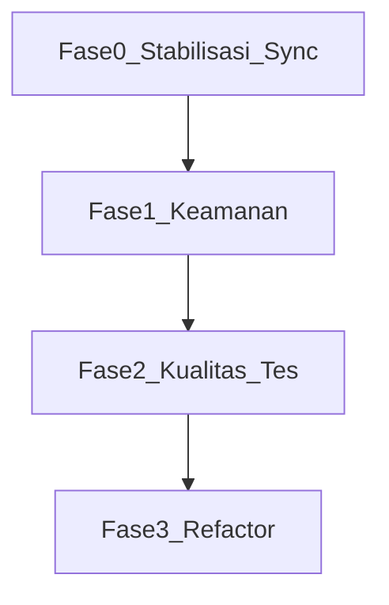

# Rencana Perbaikan — DonaPOS Mobile

| Field | Nilai |
|-------|-------|
| Versi dokumen | 1.0 |
| Tanggal | 17 Mei 2026 |
| Aplikasi | DonaPOS Mobile 2.8.0+10225 |
| Owner | _(isi nama tim / PIC)_ |
| Catatan audit | [AUDIT_CATATAN.md](AUDIT_CATATAN.md) |

---

## Ringkasan fase

| Fase | Prioritas | Estimasi | Fokus |
|------|-----------|----------|-------|
| 0 | P0 | 3–5 hari | Sync: tidak ada false positive synced, tidak ada race |
| 1 | P0–P1 | ~1 minggu | Credential, OTP, HTTPS, demo |
| 2 | P1 | 1–2 minggu | Test, analyzer hijau, error handling |
| 3 | P2 | Backlog | Refactor god files, housekeeping |

**Cara pakai dokumen ini:** centang checkbox saat selesai, isi kolom Status dan PR/commit.

---

## Fase 0 — Stabilisasi sync (P0)

**Tujuan:** Transaksi yang gagal upload tetap `synced = 0`; tidak ada dua proses sync bersamaan.

**Referensi audit:** AUD-SYNC-01, AUD-SYNC-02, AUD-SYNC-03, AUD-BG-01

| ID | Task | File utama | Est. | Kriteria selesai | Status | PR/commit |
|----|------|------------|------|------------------|--------|-----------|
| SYNC-01 | Cocokkan response sync by `invoice_no` / local tx id, bukan indeks array `k` | `lib/api_service.dart` | 4h | Unit test: batch partial fail tidak mark synced salah; log menampilkan ID yang di-mark | belum | |
| SYNC-02 | Mutex sync (flag DB / package `synchronized`); `await` pada pemanggilan di timer | `lib/sync_service.dart` | 3h | Dua pemanggilan paralel: hanya satu yang jalan; tes manual + log | belum | |
| SYNC-03 | `WidgetsFlutterBinding.ensureInitialized()` + init sqflite di Workmanager callback | `lib/sync_service.dart` | 1h | Background task sukses di device fisik; log Workmanager terlihat | belum | |
| SYNC-04 | Reset retry 401 per batch; refresh token setiap batch yang dapat 401 | `lib/api_service.dart` | 2h | Batch ke-2 dapat retry setelah token expired di batch 1 | belum | |

### Checklist Fase 0

- [ ] SYNC-01 — Match response by invoice / local id
- [ ] SYNC-02 — Mutex + await sync timer
- [ ] SYNC-03 — Workmanager binding init
- [ ] SYNC-04 — Per-batch 401 retry

---

## Fase 1 — Keamanan (P0–P1)

**Tujuan:** Secret tidak plaintext di perangkat; komunikasi release hanya HTTPS; demo tidak lolos di produksi.

**Referensi audit:** AUD-SEC-01 s/d AUD-SEC-04, AUD-DEMO-01

| ID | Task | File utama | Est. | Kriteria selesai | Status | PR/commit |
|----|------|------------|------|------------------|--------|-----------|
| SEC-01 | `flutter_secure_storage` untuk token, `client_secret`, `sync_admin_pass` | `pubspec.yaml`, `lib/api_service.dart`, `lib/screens/login_screen.dart` | 6h | Tidak ada secret sensitif di SharedPreferences plaintext | belum | |
| SEC-02 | Hapus `last_login_password`; recovery auth tanpa simpan password | `lib/api_service.dart` | 4h | Re-auth sales (`reAuthenticateForSales`) tetap jalan | belum | |
| SEC-03 | OTP/refund validasi server ATAU dokumentasi risiko + mitigasi sementara | `lib/utils_ui.dart` + backend API | 8h+ | Refund tidak bisa bypass tanpa server (ideal) | belum | |
| SEC-04 | `usesCleartextTraffic=false` + network security config (exception dev) | `android/app/src/main/AndroidManifest.xml` | 2h | APK release hanya HTTPS kecuali host dev yang di-whitelist | belum | |
| SEC-05 | Paksa ganti PIN demo / blokir demo di build release | `lib/db_helper.dart`, build flavor | 2h | APK release tidak bisa login PIN `12345` | belum | |
| SEC-06 | _(opsional)_ Hash PIN user di SQLite | `lib/db_helper.dart`, login flow | 4h | PIN tidak readable dari file DB | belum | |

### Checklist Fase 1

- [ ] SEC-01 — Secure storage
- [ ] SEC-02 — Hapus saved password
- [ ] SEC-03 — OTP server-side
- [ ] SEC-04 — HTTPS only release
- [ ] SEC-05 — Demo PIN release guard
- [ ] SEC-06 — Hash PIN (opsional)

---

## Fase 2 — Kualitas & testing (P1)

**Tujuan:** CI hijau, path kritis ter-cover test, crash tertangkap.

**Referensi audit:** AUD-CODE-02 s/d AUD-CODE-03, AUD-HK-04, lampiran analyze

| ID | Task | File utama | Est. | Kriteria selesai | Status | PR/commit |
|----|------|------------|------|------------------|--------|-----------|
| QA-01 | Perbaiki `integration_test` (tambah dev_dependency) atau hapus folder | `pubspec.yaml`, `integration_test/` | 30m | `flutter analyze` zero errors | belum | |
| QA-02 | Unit test: `PosCartController`, sync mark logic, migrasi snapshot | `test/` | 2d | Minimal 3 test file; path kritis hijau | belum | |
| QA-03 | Ganti `widget_test.dart` smoke test (splash / login) | `test/widget_test.dart` | 2h | `flutter test` hijau | belum | |
| QA-04 | `FlutterError.onError` + log ke `LoggerService` | `lib/main.dart` | 2h | Crash ter-trigger log terstruktur | belum | |
| QA-05 | Dispose `TextEditingController` di dialog POS | `lib/screens/pos_screen.dart` | 2h | Profiler 1 jam sesi POS: tidak ada leak controller | belum | |

### Checklist Fase 2

- [ ] QA-01 — Integration test / analyze
- [ ] QA-02 — Unit tests kritis
- [ ] QA-03 — Widget smoke test
- [ ] QA-04 — Global error handler
- [ ] QA-05 — Dispose dialog controllers

---

## Fase 3 — Refactor & maintainability (P2, backlog)

**Tujuan:** Kode lebih modular; versi konsisten; repo bersih.

**Referensi audit:** AUD-CODE-01, AUD-HK-01 s/d AUD-HK-05, AUD-DB-01

| ID | Task | File utama | Est. | Kriteria selesai | Status | PR/commit |
|----|------|------------|------|------------------|--------|-----------|
| REF-01 | Ekstrak modul sync dari `api_service.dart` (repository / service terpisah) | `lib/api_service.dart` → `lib/services/` | 3d | `api_service.dart` < 1500 baris; sync terisolasi testable | belum | |
| REF-02 | Lanjutkan pecah `pos_screen.dart` ke components | `lib/screens/pos/` | 5d | `pos_screen.dart` < 1200 baris | belum | |
| REF-03 | Single source versi: `pubspec.yaml` → generate / sync `config.dart` | `pubspec.yaml`, `lib/config.dart` | 1h | Versi UI = versi build | belum | |
| REF-04 | Hapus `api_service.dart.backup`; tambah ke `.gitignore` artifact build | root, `.gitignore` | 30m | Repo tanpa file backup / build_error di track | belum | |
| REF-05 | Tes upgrade DB v47→v48 dari backup produksi | `lib/db_helper.dart`, `test/` | 1d | Migrasi sukses; log migrasi lengkap | belum | |
| REF-06 | Verifikasi mapping `tax` / `round_off_amount` dengan tim backend | `lib/api_service.dart` | 2h | Dokumen kontrak API + nilai cocok di staging | belum | |

### Checklist Fase 3

- [ ] REF-01 — Ekstrak sync module
- [ ] REF-02 — Pecah pos_screen
- [ ] REF-03 — Konsolidasi versi
- [ ] REF-04 — Bersihkan repo
- [ ] REF-05 — Tes migrasi DB
- [ ] REF-06 — Kontrak pajak sync

---

## Pemetaan: ID audit → ID rencana

| ID Audit (AUDIT_CATATAN.md) | ID Rencana |
|-----------------------------|------------|
| AUD-SYNC-01 | SYNC-01 |
| AUD-SYNC-02 | SYNC-02 |
| AUD-SYNC-03 | SYNC-04 |
| AUD-BG-01 | SYNC-03 |
| AUD-SEC-01 | SEC-01, SEC-02 |
| AUD-SEC-02 | SEC-03 |
| AUD-SEC-03 | SEC-04 |
| AUD-SEC-04 | SEC-06 |
| AUD-DEMO-01 | SEC-05 |
| AUD-DB-01, AUD-DB-02 | REF-05 |
| AUD-CODE-01 | REF-01, REF-02 |
| AUD-CODE-02 | QA-05 |
| AUD-CODE-03 | QA-04 |
| AUD-CODE-04 | REF-06 |
| AUD-HK-01 | REF-03 |
| AUD-HK-02, AUD-HK-03 | REF-04 |
| AUD-HK-04 | QA-01, QA-03 |
| AUD-HK-05 | _(housekeeping saat refactor API)_ |

---

## Risiko & dependensi

| Risiko | Dampak | Mitigasi |
|--------|--------|----------|
| SEC-03 butuh endpoint backend baru | OTP tetap lemah sampai backend siap | Dokumentasi risiko + batasi refund ke role admin online |
| SYNC-01 butuh format response `/connector/api/sell` | Salah mapping field | Koordinasi tim backend; tes di staging dengan batch campuran |
| Migrasi DB gagal di lapangan | Tablet tidak bisa buka app | Backup DB sebelum update; REF-05 wajib sebelum rilis mayor |
| Secure storage breaking change | User harus login ulang setelah update | Changelog + one-time re-login acceptable |

---

## Definisi selesai (release gate)

Sebelum rilis minor berikutnya ke produksi, minimal:

1. Semua task **Fase 0** status `selesai`
2. SEC-01, SEC-02, SEC-04 status `selesai`
3. QA-01 status `selesai` (`flutter analyze` tanpa error)
4. Tidak ada regresi pada `persistTransaction` dan `effectiveDiscount` (tes manual kasir)

---

## Log perubahan dokumen

| Tanggal | Versi | Perubahan |
|---------|-------|-----------|
| 2026-05-17 | 1.0 | Rilis awal berdasarkan audit 17 Mei 2026 |

---

*Untuk detail temuan teknis, lihat [AUDIT_CATATAN.md](AUDIT_CATATAN.md).*
